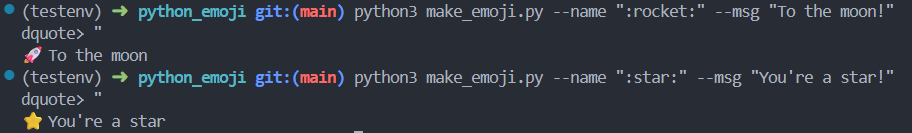

# python_emoji 🚀

A delightful command-line tool for displaying emojis with optional messages in your terminal.

## Setup

### Environment Creation and Installation

1. **Clone the repository** (if not already done):

   ```bash
   git clone <repository-url>
   cd python_emoji
   ```

2. **Create a virtual environment**:

   ```bash
   python3 -m venv testenv
   ```

3. **Activate the virtual environment**:

   ```bash
   source testenv/bin/activate
   ```

4. **Install dependencies from requirements**:
   ```bash
   pip install -r requirements.txt
   ```

## Run

### Example Commands and Output

**Basic usage with default rocket emoji:**

```bash
python3 make_emoji.py
```

**Output:** 🚀

**Custom emoji with message:**

```bash
python3 make_emoji.py --name ":heart:" --msg "Hello World!"
```

**Output:** ❤️ Hello World!

**Sparkles with custom message:**

```bash
python3 make_emoji.py --name ":sparkles:" --msg "Magic time!"
```

**Output:** ✨ Magic time!

**Help command:**

```bash
python3 make_emoji.py --help
```

## Time it

### Performance Baseline

Command used for timing:

```bash
python3 -m timeit -n 1000 -s "from emoji import emojize" "emojize(':rocket:')"
```

**Result:**

```
1000 loops, best of 5: 4.3 usec per loop
```

This shows that emoji conversion is very fast, taking only 4.3 microseconds per conversion on average.

## Test

### Running Tests

To run the test suite:

```bash
pytest -q
```

Or from the project root:

```bash
python3 -m pytest tests/ -v
```

The tests verify that:

- The script runs without errors
- Emojis are correctly displayed in output
- Command-line arguments work as expected

### Test Coverage

Current tests include:

- Basic functionality test (`test_script_runs_and_prints_emoji`)
- Verification of emoji output
- Command execution validation


